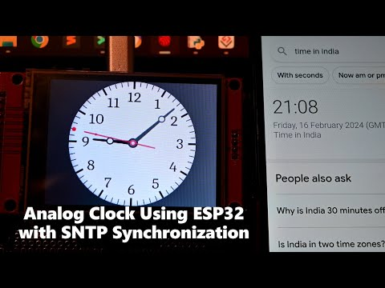
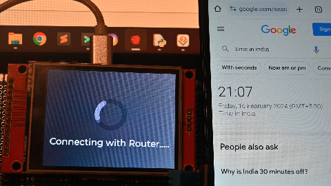
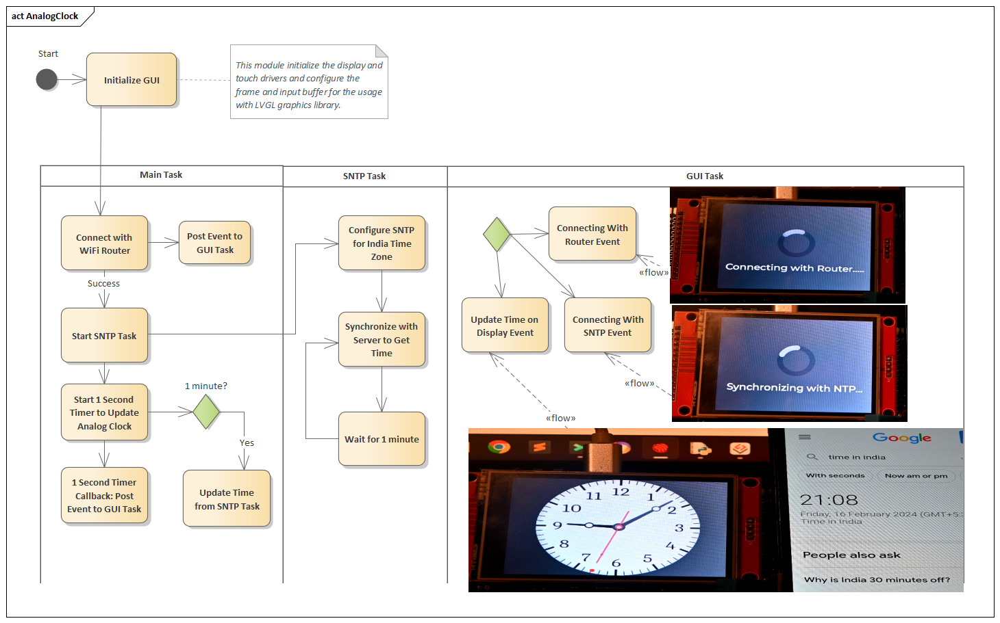

ESP32 Clock Using SNTP Time Synchronization
====================
[Want to Read this on my Blog, then Click Here](https://embeddedlaboratory.blogspot.com/2024/02/analog-clock-using-esp32-with-sntp-time.html)  

[](https://youtu.be/RO30kXc-ogI)  

Analog clocks have a timeless appeal, and adding internet-based time synchronization can make them even more fascinating.  
In this repository, we'll utilize the ESP-IDF framework and an ILI9341 display controller to create a simple analog clock synchronized with accurate time obtained via SNTP, for this post I am using India's time zone, but this can be easily changed to any other time zone. I am using the LVGL graphics library, some image assets for the background, and some images for displaying the hours, minutes, and seconds dials.  

The following image illustrates the demo of this small project, as you can see the ESP32 automatically synchronizes the time in India using the NTP servers.  


[](https://www.pcbway.com/)  
This post is sponsored by PCBWay, with more than a decade in the field of PCB prototype and fabrication, PCBWay is committed to meeting the needs of their customers from different industries in terms of quality, delivery, cost-effectiveness, and any other demanding requests.
As one of the most experienced PCB manufacturers in the World, PCBWay prides itself on being your best business partner as well as a good friend in every aspect of your PCB needs.

## UNDERSTANDING SNTP AND NTP SERVERS:
NTP (Network Time Protocol) and SNTP (Simple Network Time Protocol) are protocols used for synchronizing clocks over a computer network. They allow devices to obtain accurate time information from designated time servers.  
### NTP Servers
NTP servers are computers equipped with highly precise atomic clocks or GPS receivers. These servers are responsible for maintaining accurate time and distributing it to clients over a network. NTP servers form a hierarchical structure, with higher-stratum servers synchronizing with lower-stratum servers to ensure accuracy and reliability.

#### Stratum Levels
NTP servers are categorized into strata, with Stratum 0 being the most accurate time source (e.g., atomic clocks or GPS satellites) and Stratum 15 being the least accurate. Stratum 1 servers directly synchronize with Stratum 0 sources, while lower-stratum servers synchronize with higher-stratum servers in a hierarchical manner.

#### Public NTP Servers
Public NTP servers are maintained by organizations and institutions worldwide, offering free access to accurate time information. These servers are commonly used by devices connected to the internet for time synchronization. In this post, I will be using one of the public NTP servers.

#### Private NTP Servers
Organizations may deploy private NTP servers within their networks for internal time synchronization. These servers can synchronize with public NTP servers or higher-stratum servers within the organization's network. These types of servers are used by companies.

### SNTP Servers
SNTP (Simple Network Time Protocol) is a lightweight version of NTP designed for simpler systems or applications where high accuracy is not critical. SNTP clients are capable of synchronizing their clocks with SNTP servers using a simplified subset of NTP functionality.

#### Synchronization Process
SNTP clients periodically query SNTP servers for time updates. The servers respond with the current time information, allowing clients to adjust their clocks accordingly. Unlike NTP, SNTP does not perform complex clock synchronization algorithms and does not maintain strict synchronization accuracy.

#### Usage
SNTP is commonly used in embedded systems, IoT devices, and applications where lightweight time synchronization is sufficient. While it may not provide the same level of accuracy as NTP, it is suitable for many practical scenarios.

### COMPONENTS NEEDED
* ESP32 Development Board
* ILI9341 TFT Display
* Breadboard and Jumper Wires
* WiFi Router with which ESP32 can connect

### SOFTWARE REQUIREMENTS
* ESP-IDF (Espressif IoT Development Framework)
* Time synchronization component from ESP-IDF
* ILI9341 Display Driver

### SOFTWARE DEVELOPMENT
If you are following my blog and YouTube videos, you can use any of the following posts to reuse the existing modules, such as code to connect with the WiFi router, ILI9341 drivers, and the LVGL integration.
* [Visualizing Temperature and Humidity Data on Display and ThingSpeak using ESP-IDF](https://embeddedlaboratory.blogspot.com/2024/02/visualizing-temperature-and-humidity.html)
* [Building a Weather Station Web Server with OTA Updates Using ESP32 and ESP-IDF Framework](https://embeddedlaboratory.blogspot.com/2023/08/building-weather-station-web-server.html)
* [Temperature and Humidity Graph Using ESP32 ILI9341 DHT11 and LVGL](https://embeddedlaboratory.blogspot.com/2023/01/temperature-and-humidity-graph-using.html)


I prepared a simple activity diagram to depict what is happening inside the software.



The project is divided into three tasks, the first is the "Main Task" that triggers the other two tasks i.e. "SNTP" task and the "GUI Manager" task.
### Main Task
The main task is very simple in nature, it starts the GUI manager task, which in turn displays the busy indicator animation, that the ESP32 is trying to connect with the WiFi router. Once the router is connected, it triggers an event to the GUI manager to task, to update the labels and indicate that now we are trying to connect with the SNTP server, and here we trigger the SNTP task.

The following is the source for the "Main" task.  
```c
void app_main(void)
{
  // Disable default gpio logging messages
  esp_log_level_set("gpio", ESP_LOG_NONE);
  // disable default wifi logging messages
  esp_log_level_set("wifi", ESP_LOG_NONE);

  esp_err_t ret = nvs_flash_init();
  if (ret == ESP_ERR_NVS_NO_FREE_PAGES || ret == ESP_ERR_NVS_NEW_VERSION_FOUND)
  {
    ESP_ERROR_CHECK(nvs_flash_erase());
    ret = nvs_flash_init();
  }
  ESP_ERROR_CHECK(ret);

  // start the GUI manager
  gui_start();

  while (true)
  {
    if( wifi_connect_status == false )
    {
      // wifi not connected, connect with WiFi (it will take some time)
      app_connect_wifi();
      if( wifi_connect_status )
      {
        gui_send_event(GUI_MNG_EV_WIFI_CONNECTED, (uint8_t*)&time_info );
        ESP_LOGI(TAG, "WiFi connected, now synchronizing with NTP server.");

        // connection establish, start the SNTP task
        sntp_time_sync_start();
      }
    }
    else
    {
      // check if synchronization with NTP server is cone or not
      if( first_time_sync == false )
      {
        sntp_time_sync_get_time_tm( &time_info );
        if( time_info.tm_year > (2016-1900) )
        {
          gui_send_event(GUI_MNG_EV_SNTP_SYNC, NULL);
          ESP_LOGI(TAG, "Time Synchronization done move to next screen.");
          first_time_sync = true;
          // now start a periodic timer to update the clock every second
          // Tod Update timer
          const esp_timer_create_args_t tod_increment_timer_args =
          {
            .callback = &tod_increment,
            .name = "ToD Increment"
          };
          esp_timer_handle_t tod_increment_timer;
          ESP_ERROR_CHECK(esp_timer_create(&tod_increment_timer_args, &tod_increment_timer));
          ESP_ERROR_CHECK(esp_timer_start_periodic(tod_increment_timer, TOD_INCREMENT_PERIOD_MS * 1000));  // here time is in micro seconds
        }
        else
        {
          ESP_LOGI(TAG, "Time not synchronize, will try again..");
        }
      }
      else
      {
        time_sync_counter++;
        if( time_sync_counter > SNTP_TIME_SYNC )
        {
          time_sync_counter = 0;
          ESP_LOGI(TAG, "Synchronizing Time");
          sntp_time_sync_get_time_tm( &time_info );
        }
      }
      // common delay for both scenarios
      vTaskDelay(MAIN_TASK_TIME/portTICK_PERIOD_MS);
    }
  }
}
```
The following are the key points from the above program.
* Connect with the Wi-Fi router
Once the connection is successful send the event to the GUI Manager task to update the graphics
* Once the connection is successful start the SNTP task.
* Once the connection with the NTP server is established and we get the valid date and time, post another event to the GUI manager task to update the graphics and display the analog clock
* Start a 1-second timer, using the ESP-IDF timer software module, this timer module will increment the time by one second, and post the event to the graphical module to update the Analog clock.
* In the main task itself, after every 1 minute, the time is synchronized with the NTP server.

### SNTP Task
In the SNTP task, we configure the SNTP software module to synchronize India's time, and then we try to obtain the time every 1 minute.  
The following is the code for the "SNTP" task.  
```c
/**
 * @brief SNTP Time Sync Task
 * @param pvParameter 
 */
static void sntp_time_sync_task( void *pvParameter )
{
  while(1)
  {
    sntp_time_sync_obtain_time();
    vTaskDelay(1000/portTICK_PERIOD_MS);
  }
  vTaskDelete(NULL);
}
```
In the SNTP task function, we do the following things.
* Every 10 seconds (this can be variable also, my recommendation is to use 1 minute, as in the Main task we are getting the time after every minute), and we try to get the time information from the NTP server.
* But at power-up the time is not correct this can be checked by getting the value year value.
* If the year values are out-of-range, we initialize the SNTP software mode in polling mode and update the server name as "pool.ntp.org", this is a free public NTP server, which we mentioned above, and once this is done, initialize the SNTP module by calling the function "sntp_init".
* Once the above step is done, we will set the India time zone as shown below.
  ```c
  // set the local time zone (this is the Indian Time Zone)
  setenv("TZ", "IST-5:30", 1);
  tzset();
  ```

#### Configuration Steps
* After the FreeRTOS task kicks off and obtain time function is called, the initialize SNTP funcion is called, where the first SNTP function used, configures the client in poll mode to query the server every `n` seconds.
  * `sntp_setoperatingmode(SNTP_OPMODE_POLL)`
* Also, within the SNTP initialize function, we will tell the client which server to use. A common choice is a cluster of servers from `pool.ntp.org`, `sntp_setservername(0, "pool.ntp.org")`.
* Then we will initialize the service, i.e. by using `sntp_init()`
* Set the Time Zone variable and initialize the time zone conversion.
  * Set the Time Zone, for example `setenv("TZ,"CET-1",1")` and `tzset()` to initialize the timezone conversion routine.
* After SNTP service is initialized, we need to check if the system clock has the updated time.
  * To get the actual time from the system clock, we use the `time()` function, which updates the `time_t` variable.
  * To split the variable into different time values (year, month, day...), the `localtime_r` function is used which updates the `tm` structure.
    ```C
    time_t now = 0;
    struct tm time_info = { 0 };
    time(&now);
    localtime_r(&now, &time_info);
    ```
  * We will then check the information from the `tm` structure to see if the time was set yet.
    ```C
    if( time_info.tm_year < (2016 - 1990) )
    {
      sntp_time_sync_init_sntp();
      // set the local time zone
      setenv("TZ,"CET-1",1");
      tzset();
    }
    ```

### GUI Task
The Graphical task is similar to the previous projects, here one of the important things is to develop the graphics, like the background, and dials for the clock, which can be done in tools like "Inkscape" etc, unfortunately this is not my expertise area, so I downloaded these graphics from online, there are several websites which provide free graphics. The following are the graphics that I used to make the analog clock.


---
| Hour Dial| Minute Dial | Second Dial |
| -------- | ----------- | ----------- |
||||
---

Then all of these three dials are combined together and every second is updated, using the following code.  
```c
static void gui_update_time( uint8_t *pData )
{
  struct tm *time_info;
  time_info = (struct tm*)pData;
  // one second increment is equals to 6 degrees, full round is 360 and total
  // seconds is 60, hence 360/60 = 6 and then for LVGL * 10
  int16_t seconds_angle = (int16_t)(time_info->tm_sec * 60);
  // same as seconds for minutes
  int16_t minute_angle =  (int16_t)(time_info->tm_min * 60);
  // one hour increment is equal to 30 degrees, full round is 360 degree & total
  // hours is 12, hence 360/12 = 30 degrees, and then for LVGL x 10
  // also compensate for minute changes also, hour angle = hour*30 + (minute/60)*30 and then for LVGL multiply by 10
  // hour angle = (hour*30 + (minute*30/60))*10 => this 10 is for LVGL
  // simplified as = hour*30*10 + minute*300/60
  // further simplified as = hour*300 + minute*5
  int16_t hour_angle = (int16_t)((time_info->tm_hour * 300) + (time_info->tm_min*5) );
  ESP_LOGI(TAG, "Time Values: %d:%d:%d", time_info->tm_hour, time_info->tm_min, time_info->tm_sec);
  ESP_LOGI(TAG, "Time Angles: %d, %d, %d", hour_angle, minute_angle, seconds_angle );
  lv_img_set_angle(ui_imgSecond, seconds_angle);
  lv_img_set_angle(ui_imgSecDot, seconds_angle);
  lv_img_set_angle(ui_imgMinute, minute_angle);
  lv_img_set_angle(ui_imgHour, hour_angle);
}
```

The above code is executed every second because an event is triggered from the "Main" task every second to update the display.

## Conclusion
You can download the complete code from this GitHub repository.  
So with this project, you have now synchronized the time just like the smartphones from the NTP servers.  
This project can be further updated to synchronize and display the time of various locations by setting the respective time zone, and also a digital clock shall be added, in case someone wants to view the time using a digital clock.
In case you have some doubts or comments regarding this project, feel free to use the issues section on GitHub.