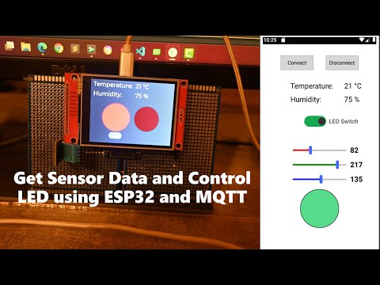

Get Sensor Data and Controlling Devices Using ESP32 and Android Application over MQTT
====================

### [Click Here If You Want to Read the Blog](https://embeddedlaboratory.blogspot.com/2024/02/get-sensor-data-and-controlling-devices.html)

### YouTube Video
[](https://www.youtube.com/watch?v=xyCAHg4jrOE)

Hello everyone, In this post I will explain the working of my project based on the ESP32 microcontroller.  
In this project, I will show you, how to control the devices and get sensor data using ESP32 microcontroller and MQTT.  
The following is a demo animation of this project.  


As you can see in the above animated image the ESP32 is connected with the DHT11 sensor to sense the temperature and humidity data and it is also connected with the TFT display, which is used to display the temperature and humidity values.  
You can see on the display there are 2 LEDs, one is a normal Red LED and one is a RGB LED. I didn’t use the physical LEDs instead I am simulating the LEDs using the LVGL graphics library. There is a switch, which is used to control the single-color LED state.  

<[](https://www.pcbway.com/)  >

*This project is sponsored by PCBWay, with more than a decade in the field of PCB prototype and fabrication, PCBWay is committed to meeting the needs of their customers from different industries in terms of quality, delivery, cost-effectiveness, and any other demanding requests.*
*As one of the most experienced PCB manufacturers in the World, PCBWay prides itself on being your best business partner as well as a good friend in every aspect of your PCB needs.*

I will use this block diagram to explain what is happening inside the system, as the first step the ESP32 will connect to the Wi-Fi router, and after the connection is successful, it will connect with the MQTT broker, once the connection is successful, it will start publishing the Sensor data to the broker.


On the other hand, the application developed using the QT framework, will subscribe to this data, and display this on its application, similarly, we can control the LEDs from the application, using a normal switch which is used to control the red LED and also by using the sliders, with sliders we can generate a color, and the same color will be displayed on the ESP32 TFT screen.


The above image illustrates the user interface of the application is developed, this application is intentionally developed using the QT framework, so that it can run on all major operating systems like Windows, Android, Linux, and others, without any modifications, as QT is cross-platform.  

### Components Needed:
* ESP32 Development Board
* ILI9341 TFT Display
* Breadboard and Jumper Wires
* WiFi Router with which ESP32 can connect


From the above picture, the pinout is not visible properly, so you use the below-mentioned table for the connections.  


### Software Requirement
* ESP-IDF (Espressif IoT Development Framework)
* Time synchronization component from ESP-IDF
* ILI9341 Display Driver

### Project Explaination
* At power-up ESP32 will connect to the WiFi router and then it will connect with the MQTT broker, here I am using the free MQTT broker, for hobby based project the free MQTT broker such as `test.mosquitto.org` is sufficient, but keep in mind to not send any sensitive data.
* Clicking on the `connect` button will connect the application to the MQTT broker and clicking on the `disconnect` button will disconnect it from the MQTT broker.
* Moving the switch button to the `On` position in the application or on the TFT screen will turn on the LED on the ESP32, and moving the switch button to the `Off` position in the application or on the TFT position will turn it off.
* The switch button in the application is synchronized with the switch button on the TFT display, which means if we change the state of the switch button on the TFT display, the state is adjusted in the application also.
* Now coming to the sliders, there are three sliders to control the Red, Green, and Blue colors of the LED, as we change the slider, the colors are changed, and the same colors are displayed on the TFT screen, this feature can be used to control the RGB LED bulbs, a Home Automation project.
* Moving the sliders to 0, 0, 0 position means LED off, which is represented as black color, similarly setting the value 255, 255, 255 will represent the full white color.
* Sometimes you might feel that the color generated on the application does not exactly match the color on display, but this is due to the camera recording, with naked eyes this looks exactly similar.
* Since we are using the QT framework the same application works the same on Windows, Android, and Linux platforms, I have tested this on Windows and Android, but I am very sure that it will work on other platforms also without any modification.

### Conclusion
This is a small project made by using ESP32, DHT11, and ILI9341 display controllers, the project can be extended to make a full home automation project, where sensor data from several devices can be published and displayed on the applications, in future my plan is to visualize this whole data on Grafana as a dashboard, similar to this project.


### NOTES
Broker Used `test.mosquitto.org`.  
#### Pulish Command
```
mosquitto_pub -h "mqtt.eclipseprojects.io" -t "my_topic" -m "Hello World"
```
#### Subcsribe Command
```
mosquitto_sub -h "mqtt.eclipseprojects.io" -t "my_topic"
```


